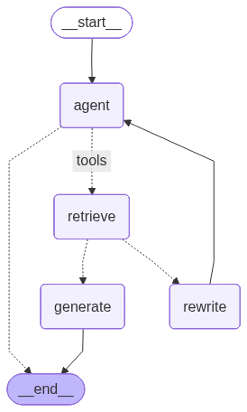

# Agentic RAG using LangChain & LangGraph

This repository implements an **Agentic Retrieval-Augmented Generation (RAG)** system using **LangChain** and **LangGraph**.  
Unlike traditional RAG pipelines, this system uses an **agent-driven control loop** that can decide **when to retrieve, rewrite queries, generate answers, or terminate execution**.

The workflow is explicitly modeled as a **stateful graph**, enabling transparency, debuggability, and human-in-the-loop extensibility.

---

## 🧠 What Makes This Agentic RAG?

Traditional RAG follows a fixed pipeline:

> Retrieve → Generate → Answer

This implementation is **agentic**, meaning:
- The agent decides **whether retrieval is needed**
- The agent can **rewrite the query** if retrieval fails
- The agent can **loop** until sufficient context is available
- Control flow is **dynamic**, not linear

LangGraph enables this by modeling the workflow as a **graph with conditional edges**.

---
## 🏗️ Architecture Overview




### Execution Flow

```text
__start__
   ↓
 agent
   ↓ (if tools needed)
 retrieve
   ↓
 generate
   ↓
 __end__

 OR

 agent
   ↓
 rewrite
   ↺ (loops back to agent)
